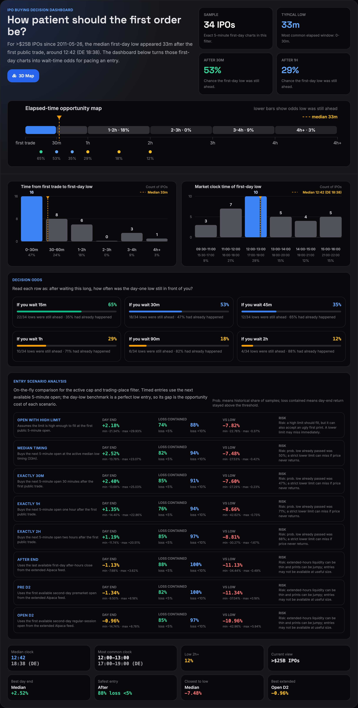
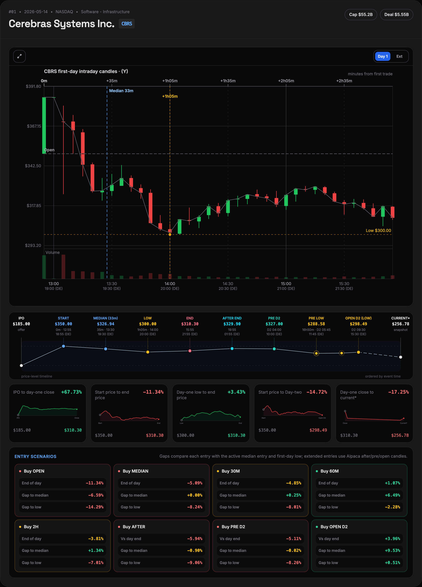
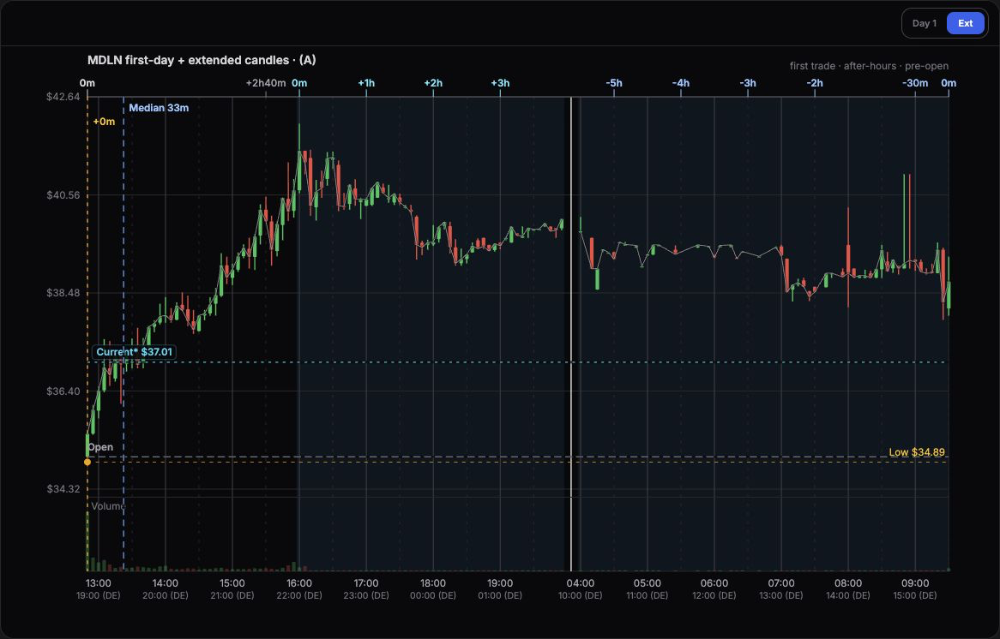
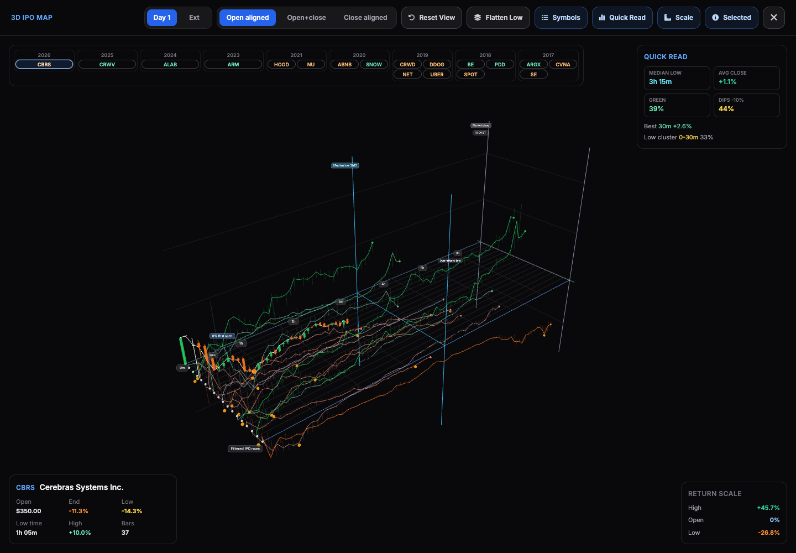
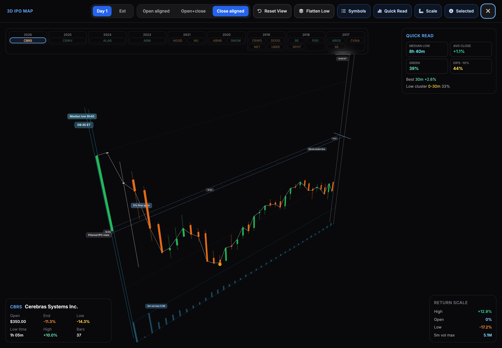
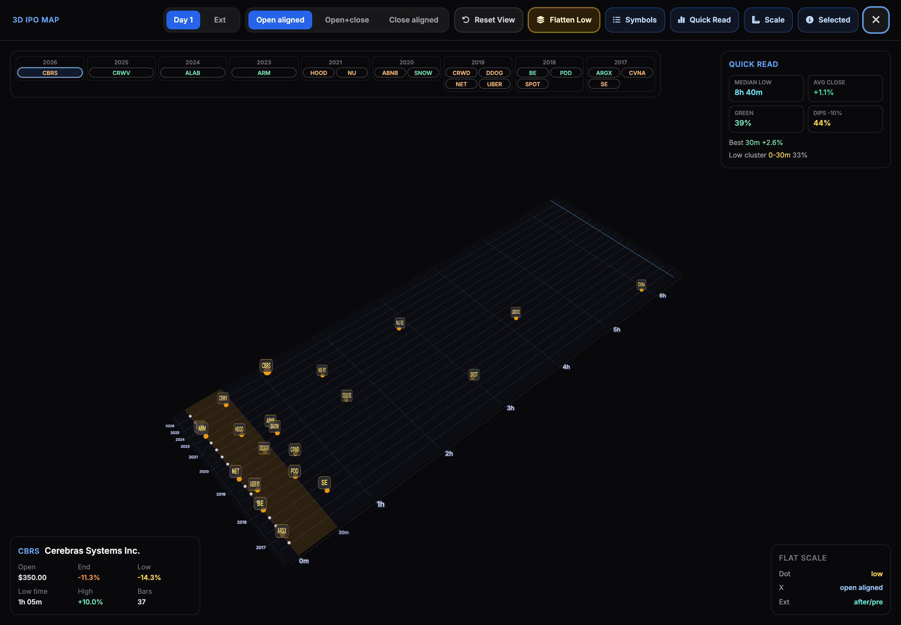
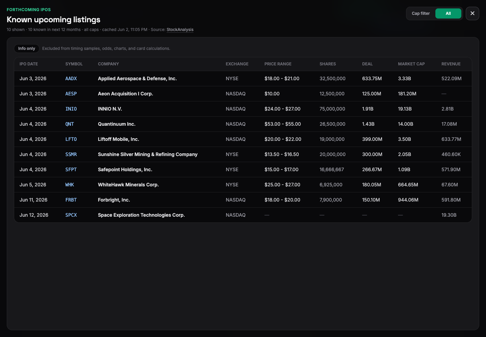

# IPO Site

Static first-day IPO chart page for `https://glaubi.net/ipo`.

The site shows large IPO companies as full-width cards only when exact 5-minute IPO-day bars are available, plus a top buying-decision dashboard built from exact Day 1, extended-hours, and Day 2 candles where available. The header market-cap filter defaults to `>$25B`, the trading-place filter defaults to `All`, and both switch the card list plus the analysis. The global analysis range defaults to `D1 Ext` and can switch between `Day 1`, `Ext`, `D1 D2`, and `D1 Ext D2`; card charts default to `D1 D2` and can be switched per card between `D1`, `D1 Ext`, `D1 Ext D2`, `D1 D2`, and `D2`. Each card links the company name to its Yahoo Finance quote page, shows cap plus deal-size pills in the header when available, and uses an ordered price-level timeline for IPO/start/low/median/end, after-hours, pre-D2, open-D2, end-D2, and current runtime price events. Cards intentionally do not show the ambiguous generated IPO-to-current return field.

Each card also includes six micro charts comparing IPO price, D1 start, D1 low, D1 close, open D2, D2 close, and current runtime price. Micro-chart lines use exact IPO-day 5-minute closes where possible, extended/Day 2 milestones for the Day-two path, and sampled Yahoo weekly closes for rough longer-term current paths. Entry-scenario tables compare buying at the open, active median timing, 30 minutes, 60 minutes, after-hours end, second-day premarket, second-day open, and second-day end. Rows compare each buy against End D1, the median entry, the absolute low across available D1/Ext/D2 candles, End D2, and, on card-local tables only, Current. Scenario border color ranks the entries by absolute `Vs Current` opportunity.

The dashboard also opens a Three.js `3D Map` view from the analysis panel. It renders filtered IPO paths, a hideable year-clustered symbol list, Day 1/Ext modes, open/open+close/close alignment modes, hideable Quick Read/Scale/Selected panels, selected-symbol candles, an isolated one-row candle view with normalized return scale and linear 5-minute volume bars, and a `Flatten Low` mesh that places low markers on a comparable timing plane.

The header `Forthcoming IPOs` button opens an info-only IPO-list modal from the StockAnalysis calendar. It shows known listings in the next 12 months with date, symbol, company, exchange, price range, shares, deal, market cap, and revenue, and can switch between all listings and the active cap filter. These upcoming rows are deliberately excluded from timing samples, odds, charts, and card calculations.

The default chart view is now `D1 D2`: it stitches Day 1 regular trading and Day 2 regular trading without drawing an empty overnight gap. The D2 open is marked with a thin light-gray vertical line behind the candles, the top elapsed axis suppresses the duplicate D2 `0m` label, and the bottom clock axis keeps the important early Day 2 hour label while allowing the far-right close label to be omitted when space is tight. Candle hover cards use a compact old-style layout and follow the mouse cursor vertically.

## Screenshots















## Files

- `index.html` - static page, styles, decision dashboard, chart renderer, filters, search, and sort toggle.
- `three-ipo-view.js` - Three.js IPO map renderer, symbol selection, isolated candle view, flattened low mesh, and 3D controls.
- `ipo-data.js` - generated IPO card metadata.
- `chart-data.js` - generated exact 5-minute first-day bars, optional Alpaca extended-hours bars, optional Alpaca Day 2 bars, and sampled rough weekly close paths where available.
- `current-price-cache.json` - bundled Yahoo current-price cache used as a fast runtime seed before browser-side quote refreshes.
- `ipo-analysis.js` - generated 15-year low-timing analysis and timing insights, precomputed per cap and trading-place filter.
- `ipo-buy-signals.js` - generated public buy-timing state strips and pins from the private one-minute XGBoost experiment.
- `results.html` - separate alternative one-minute IPO entry-timing report linked from the main page.
- `results-data.js` - generated report bundle from the sibling IPO-analysis workspace; its optional TimesFM benchmark now uses the zero-shot `google/timesfm-3.0-pytorch` checkpoint and is not part of the live signal.
- `refresh_ipo_data.py` - refreshes IPO metadata, chart data, and analysis.
- `build_ipo_analysis.py` - rebuilds only `ipo-analysis.js` from existing generated data.
- `vendor/three.module.min.js` - local Three.js module used by the 3D map; no charting CDN is required for the map.
- `1m/` - ignored local research folder for one-minute candle gathering scripts, symbol-specific `*-first-day-1min-candles.json` and `*-second-day-1min-candles.json` data, private dependencies, and the buy-signal generator.

## Run Locally

```sh
python3 -m http.server 8080
```

Open `http://localhost:8080`.

## Refresh Data

```sh
python3 refresh_ipo_data.py --threshold-b 5 --limit 500 --candidate-limit 1000
```

The refresh uses StockAnalysis for IPO metadata, Yahoo Finance chart endpoints for latest quote prices, rough weekly mini-chart history, and first-day OHLCV data, and Alpaca market data as the main exact intraday fallback when paper/data credentials are available through `APCA_API_KEY_ID` plus `APCA_API_SECRET_KEY` or compatible `ALPACA_*` env vars. Alpaca also provides optional extended-hours and Day 2 chart data. Candle charts use only exact 5-minute rows in `chart-data.js`; missing exact bars are suppressed rather than estimated.

API keys are read only from the environment and must not be committed. Alpaca credentials are sent only in request headers. Alpha Vantage remains an optional fallback, but historical intraday month requests require a premium-enabled Alpha Vantage key.

Current prices are refreshed at runtime in browser JavaScript through the Yahoo proxy route and cached as path-namespaced IndexedDB records; generated `current` values and `current-price-cache.json` remain fallbacks. The live site depends on the Cloudflare Worker proxy for `/ipo/api/yahoo/...`; local testing uses `http://localhost:8787/ipo/api/yahoo` when the proxy dev server is running.

## Browser Cache

Runtime quote data and the forthcoming-IPO calendar are regenerable browser caches, so they live in IndexedDB under the `ipo-site-cache-v1` database with record keys namespaced to the `/ipo/` base path. The legacy `localStorage` keys `ipo-yahoo-current-quotes-v2` and `ipo-upcoming-calendar-v1` are read once, migrated into IndexedDB when possible, and removed. Quote cache writes are capped to the most recent 300 symbols, while upcoming IPO rows are pruned to the next 12 months and capped at 240 rows. If a runtime error interrupts the page, the recovery overlay can reload or clear only this IPO app's IndexedDB records plus those legacy localStorage keys.

Clock-time analysis is shown with dual 24-hour labels in `HH:MM (DE HH:MM)` format, or as two lines where space is tight, converted with daylight-saving rules. The visible analysis UI has a buyer-window summary, decision-oriented KPI cards (`Sample`, `Typical low time`, `Buy bias`, `Entry plan`), a full-width elapsed-time opportunity map, two larger distribution charts with dynamic median reference lines, a `Buy-plan questions` section, and an entry-scenario comparison table. A compact two-thumbnail infographic strip above search opens the playbook and buy-timing guides. The low-timing dashboard comes from `ipo-analysis.js`; entry-scenario comparisons are calculated in the browser from the active filtered exact bars and runtime current prices.

Main candle charts show only real 5-minute bars. First-day charts include a top elapsed-minutes axis from the first public trade, bottom NYC/German clock labels, the active-filter median timing reference line, the first public open reference line, the low reference, and conditional IPO-price/current-price horizontal reference lines only when those prices fall inside the visible OHLC range. Stitched D1/Ext/D2 charts shade extended-hours regions, restart the top elapsed axis at `0m` for after-hours, premarket, and D2 regular-session segments, and do not draw empty overnight time across the x-axis. Each card chart has an enlarge button that opens the current chart in a full-screen modal. Low markers are selected from the same near-low price band and are spaced at least one hour apart so late retests are visible without labeling every adjacent candle. Visible candle source labels are compact provider markers such as `(Y)` for Yahoo and `(A)` for Alpaca.

## XGBoost Buy Signals

The chart can overlay a public `Wait` / `Watch` / `Buy` strip generated from private one-minute IPO candles. The raw minute candles live in ignored `1m/<symbol>-first-day-1min-candles.json` and `1m/<symbol>-second-day-1min-candles.json` files, and the generator stays in ignored `1m/`; only `ipo-buy-signals.js` is committed. That public file contains chart-ready state ticks, selected pins, and metadata such as the model id, thresholds, symbol count, session counts, and sample count.

The current implementation is `ipo-minute-xgboost-downside-v1`, trained with `xgboost.XGBRegressor` on 86,488 minute-level samples across 157 IPOs: 33,639 Day 1 regular-session samples plus 52,849 Day 2 regular-session samples. At each minute, the model estimates the remaining downside to that session's remaining low from the next executable open. The target is stored in basis points in the artifact for precision, where 45 basis points means 0.45%; the UI renders this as plain percentages. A state becomes `Buy` when the predicted remaining downside is at or below 0.45%, `Watch` when it is at or below 1.50%, and `Wait` above that. A time-based forced pin is kept after 180 elapsed minutes so each covered chart can still show a late-session entry reference when the threshold buy never appears.

XGBoost fits this scenario because IPO minute candles are noisy, nonlinear, and sparse. A boosted-tree regressor can combine timing, price action, range, wick, volume, session, and momentum patterns without assuming a straight-line relationship between those inputs and the eventual low. It also works well on tabular data with mixed scales and missing-ish market behavior, which is exactly what early IPO trading produces. For now the model is a decision aid for chart timing, not a trading guarantee: it answers "how much lower might the next executable entry still be from the remaining Day 1 or Day 2 regular-session low?" and the chart turns that estimate into readable `Wait`, `Watch`, and `Buy` states.

Regenerate the public artifact from the private folder with:

```sh
python3 1m/build_buy_signals.py --input-dir 1m --output ipo-buy-signals.js
```

To rebuild only the derived analysis:

```sh
python3 build_ipo_analysis.py --input-dir . --output-dir .
```

## Verify

```sh
python3 -m py_compile refresh_ipo_data.py build_ipo_analysis.py
perl -0ne 'while(/<script>(.*?)<\/script>/sg){print $1}' index.html > /tmp/ipo-inline.js && node --check /tmp/ipo-inline.js
node --input-type=module --check < three-ipo-view.js
node --check ipo-buy-signals.js
```

If `1m/build_buy_signals.py` changed locally, also run:

```sh
python3 -m py_compile 1m/build_buy_signals.py
```

For visual QA, serve the page locally and check that the header cap, trading-place, and analysis-range filters change the `Sample`, KPI cards, distribution charts, buy-plan questions, global entry-scenario analysis, and card count together. Also check the compact timing/playbook infographic thumbnails and modals, search, sort toggle, load-more button, chart enlarge modal, the `CBRS` chart, rough-path micro charts, card entry-scenario tables, the Yahoo Finance company-name links, and at least one Alpaca-sourced chart such as `CRWV` or `CBRS`. In main candle charts, verify the top elapsed axis, bottom NYC/German clock labels, compact provider marker, blue median timing line, gray open reference line, buy-signal strip, and confirm IPO/current price reference lines appear only when in range. Toggle card-level chart modes for `D1`, `D1 Ext`, `D1 Ext D2`, `D1 D2`, and `D2` to verify stitched candles, shaded extended-hours regions, restored bottom time labels, D2 low labels, the thin gray D2 open marker behind candles, and the compact hover card following the cursor. Open the `3D Map`, check the year-clustered symbol pills, selected-symbol candles, isolated one-row candle/volume view, `Flatten Low` mesh, alignment controls, reset behavior, and hideable info panels. Open `Forthcoming IPOs` and confirm the info-only list renders, links to StockAnalysis, and respects the all/cap-filter toggle.

## Deploy

This repo is pushed to GitHub at `https://github.com/robertZaufall/ipo`. The public route `https://glaubi.net/ipo` is served by the Cloudflare Worker in `<local-ipo-proxy-repo>`, which fetches the static files from GitHub raw `main` and injects `<base href="/ipo/">`.

```sh
git add .gitignore index.html three-ipo-view.js vendor/three.module.min.js vendor/three.LICENSE.txt ipo-data.js chart-data.js current-price-cache.json ipo-analysis.js ipo-buy-signals.js refresh_ipo_data.py build_ipo_analysis.py README.md LICENSE AGENTS.md docs/*.png
git commit -m "Update IPO site"
git push
```

After pushing, verify the live Worker route with a cache-busting query:

```sh
curl -I https://glaubi.net/ipo
curl -fsSL 'https://glaubi.net/ipo?v=<commit>' | rg 'LOW_MARKER_MIN_GAP_MINUTES'
! curl -fsSL 'https://glaubi.net/ipo?v=<commit>' | rg 'IPO return|Return —'
```

## License

MIT. See `LICENSE`.
